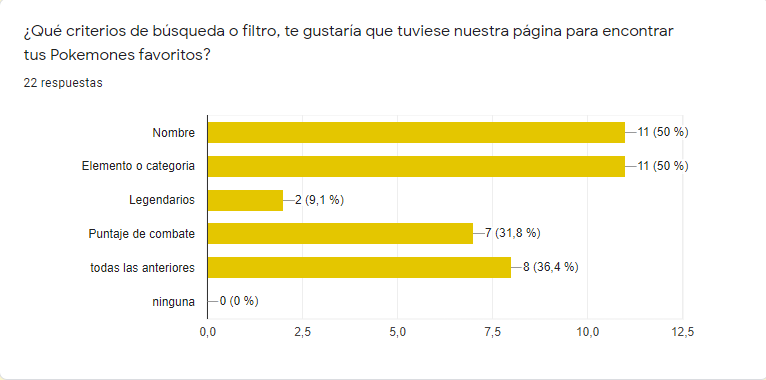
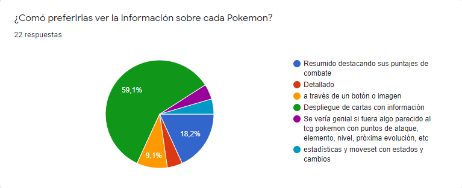
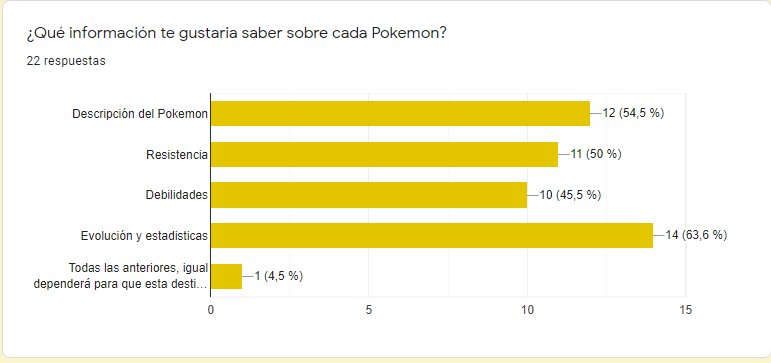
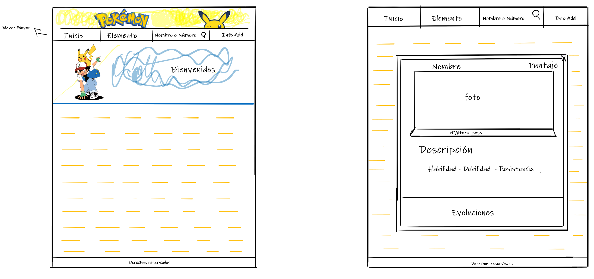
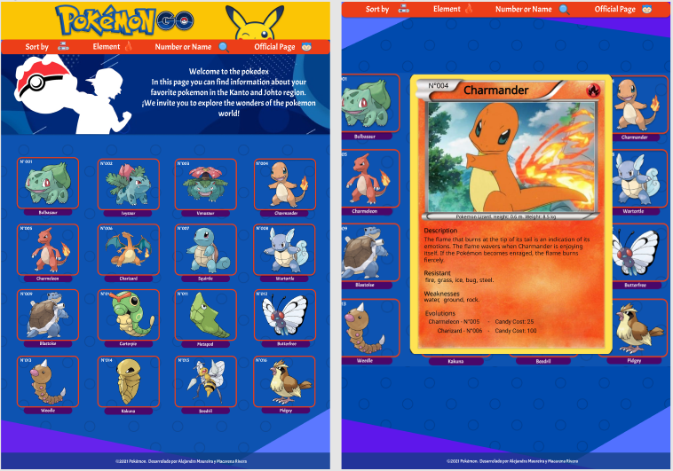

# Data Lovers - Pokémon Go

## Resumen del Proyecto

En este proyecto construimos una página web para visualizar una base de datos y de la cual, elegimos Pokémon Go y la adecuamos a las necesidades de nuestros usuarios a través de una breve encuesta que adjuntamos a continuación:

https://docs.google.com/forms/d/1dwHrizpQgRaC4ZwX5jlFn0t1pndnoO4jqq-WBoDh01I/edit

## Definición de producto

Este proyecto está basado en el juego de Pokémon Go, el cual permite mostrar todos los Pokemones pertenecientes a la región de Kanto y Johto, siendo en total 251.
Podrás elegir un Pokémon y ver sus características más relevantes. Además podrás filtrar a estos según su tipo de elemento, podrás realizar búsqueda por nombre o número y el link que te redireccionará a la página oficial.

## Encuesta

Como mencionamos anteriormente a través de una encuesta que realizamos obtuvimos las historias de usuarios y nos planificados en base a esto:

# Historias de Usuario

A continuación detallaremos 3 historias de usuarios que elegimos para la construcción de nuestra página:

HU1 - Yo como usuario novato quiero ver la lista de Pokemones, para saber cuales me pueden interesar o conocerlos.

HU2 - Yo como usuario conocedor de Pokémon, me gustaría filtrar la información por nombre/número - elemento/categoría.

HU3 - Yo como usuario regular, prefiero ver la información con despliegue de cartas Pokémon.

# UX

## Prototipo de baja fidelidad

Nuestro prototipo fue realizado en Paint 3D basándonos en las historias de usuarios mencionadas anteriormente.

## Prototipo de alta fidelidad

Nuestro prototipo lo realizamos en Figma, el cual contaba con una idea original en la parte de despliegue de la información de que esta fuera una carta Pokémon de los inicios del juego, pero mediante fuimos avanzando en el proyecto tomamos la decisión de modificar el diseño, reemplazandolo por uno más genérico.

## Testeos de Usabilidad

Nuestra página fue testeada por 4 personas, las cuales nos dieron el siguiente feeback:

1. Cambiar en la opción de "sort by" en la barra de navegación y reducirla dejando solo las opciones de ordenar de la "a-z" y de la "z -a".

2. Hacer más visible y entendible el input, ya que no era claro que se podía escribir directamente. Además de modificar el detalle de "Number or name" por la opción de search for, que es más específico.

3. Hacer más grande el cierre (X) y el número de cada Pokémon en el despliege de información.

4. Por último, darle movilidad a las cartas al pasar sobre ellas para que se entienda que hay una acción al pincharlas.

## Solución de problemas

En base a el testeo de usabilidad decidimos hacer los siguientes cambios en nuestra página:

 - Cambiar el texto del input por "Shearch..." y hacerlo más visible.
 - Agrandar la (X) y darle un pointer, además aumentamos el tamaño del número.
 - Darle dinamismo al contendor de los Pokemones utilizando hover.

 En conclusión, solo modificamos la parte visual de la página arreglando pequeños detalles, ya que en sí, la funcionalidad resultó bastante amigable para los usuarios tanto novatos como expertos.

 # Página web

 En nuestra página podrás encontrar una breve introducción sobre el mundo Pokémon junto con una barra de navegación, la cual contiene los filtros de sort by (A-Z y Z-A), Elements (Tipos), Search (input de búsqueda) y official page (link a la página oficial). Además se desplegan los 251 tipos de Pokemones, en el cual al poner el cursor sobre uno de ellos tendrás la opción de conocer más información sobre ellos.

## Acceso a la plataforma

Para que puedas ingresar o visualizar nuestro proyecto solo basta con hacer click en el link que te dejaremos a continuación desde tu dispositivo:

https://alemaureira22.github.io/SCL018-data-lovers/src/

